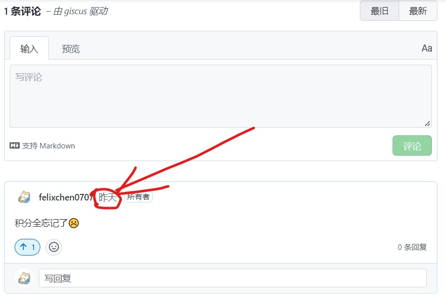
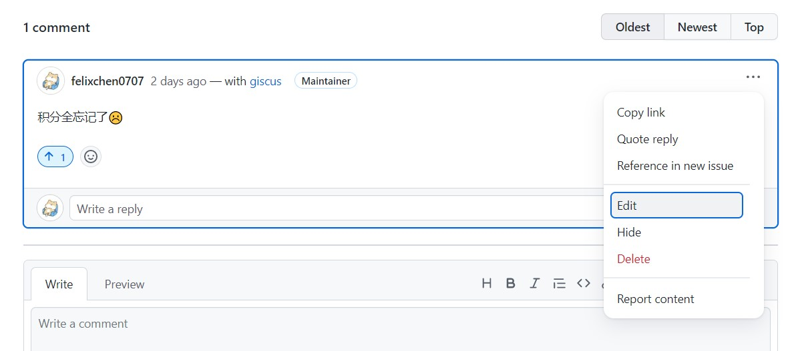
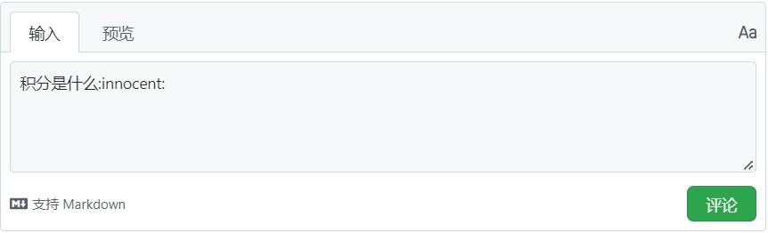
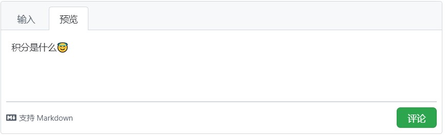

# 讨论交流

在此页面，你可以发布你的评论供大家交流。

## Q&A

### 为什么我的重积分号打不出来？

可能是由于mathjax不支持，请使用`$$\bigcirc\kern{-13.5pt}\int\kern{-7.2pt}\int$$`代替，效果如下：

$$
\bigcirc\kern{-13.5pt}\int\kern{-7.2pt}\int
$$

同样的，请使用`$${{\int\kern{-8.5pt}\int\kern{-8.5pt}\int}\kern{-22mu}}{\\ \bigcirc}$$`.

$$
{{\int\kern{-8.5pt}\int\kern{-8.5pt}\int}\kern{-22mu}}{\\ \bigcirc}
$$

### 我可以修改我的评论吗？
   
giscus不支持直接修改评论，但这并不意味着你不能修改你的评论。点击你的评论的时间戳，如下图所示。

而后你会来到存储你评论的地方，点击`Edit`即可。

### 在评论里使用emoji表情？

Markdown可以自行渲染emoji表情，不过你需要以正确的方式输入。前往[emoji-cheat-sheet仓库](https://github.com/ikatyang/emoji-cheat-sheet/blob/master/README.md)查看对应emoji的`shortcode`，而后在Markdown中使用即可。示例如下：

